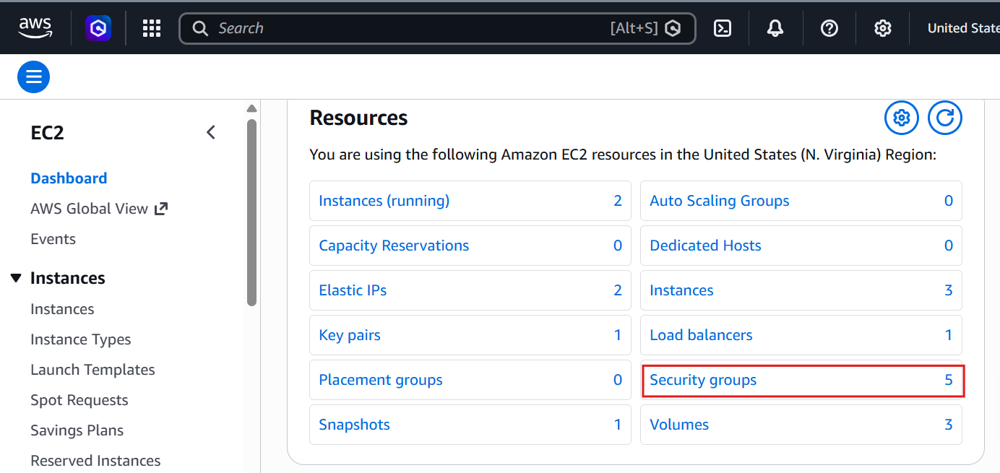

# Laboratorio: Escalabilidad, Alta Disponibilidad y Observabilidad en AWS

Propósito del Laboratorio 

En una arquitectura moderna no basta con desplegar una aplicación y esperar que responda correctamente. Los sistemas deben ser capaces de:
- Atender más usuarios cuando aumenta la demanda
- Mantenerse disponibles cuando una instancia falla
- Distribuir tráfico entre múltiples servidores
- Detectar fallos mediante health checks
- Observar métricas de carga, disponibilidad y rendimiento
- Tomar decisiones con base en datos reales

Este laboratorio integra tres conceptos fundamentales:
| Concepto                | Definición                                                                | Enfoque en el lab                                                                                    |
| ----------------------- | ------------------------------------------------------------------------- | ---------------------------------------------------------------------------------------------------- |
| **Escalabilidad**       | Capacidad del sistema para adaptarse al aumento o disminución de la carga | Escalabilidad horizontal con Amazon EC2 Auto Scaling                                                 |
| **Alta Disponibilidad** | El sistema sigue funcionando aunque falle alguno de sus componentes       | Application Load Balancer distribuyendo tráfico entre múltiples instancias y zonas de disponibilidad |
| **Observabilidad**      | Entender qué ocurre dentro de la arquitectura mediante señales            | Métricas, logs y eventos en Amazon CloudWatch                                                        |

---

## ESCALABILIDAD HORIZONTAL

Crear Security Group para el Load Balancer (sg-alb-scalability)

**Create security group**

| Campo                   | Valor                                                                               |
| ----------------------- | ----------------------------------------------------------------------------------- |
| **Security group name** | `alb-scalability`                                                                |
| **Description**         | `Security group para el Application Load Balancer` |
| **VPC**                 | VPC por defecto                                                       |

En Inbound rules (Reglas de entrada)

| Tipo | Protocolo | Puerto | Origen      |
| ---- | --------- | ------ | ----------- |
| HTTP | TCP       | 80     | `0.0.0.0/0` |

En Outbound rules (Reglas de salida)

| Tipo        | Protocolo | Puerto | Destino     |
| ----------- | --------- | ------ | ----------- |
| All traffic | All       | All    | `0.0.0.0/0` |

Clic en "Create security group"

**Crear Security Group para las instancias EC2 (sg-ec2-scalability)**

Create security group

| Campo                   | Valor                                                                 |
| ----------------------- | --------------------------------------------------------------------- |
| **Security group name** | `ec2-scalability`                                                  |
| **Description**         | `Security group para instancias EC2` |
| **VPC**                 | VPC por defecto                    |

En Inbound rules

| Tipo | Protocolo | Puerto | Origen                                               |
| ---- | --------- | ------ | ---------------------------------------------------- |
| HTTP | TCP       | 80     | **Custom** →   `alb-scalability` |
| SSH  | TCP       | 22     | **My IP** |

En Outbound rules, déjalo por defecto (All traffic → 0.0.0.0/0).

Clic en "Create security group"

**Crear la instancia base (web-scalability-base)**

Name and tags

| Campo    | Valor                  |
| -------- | ---------------------- |
| **Name** | `web-scalability-base` |

Application and OS Images (Amazon Machine Image)

| Campo   | Valor                                                                                             |
| ------- | ------------------------------------------------------------------------------------------------- |
| **AMI** | **Amazon Linux 2023**  `t3.micro`  |

Instance type

| Campo             | Valor                   |
| ----------------- | ----------------------- |
| **Instance type** | `t2.micro` |

Key pair (login)

| Campo        | Valor                                                                     |
| ------------ | ------------------------------------------------------------------------- |
| **Key pair** | **Proceed without a key pair** |

Network settings

| Campo                          | Valor                                                           |
| ------------------------------ | --------------------------------------------------------------- |
| **VPC**                        | VPC por defecto                                              |
| **Subnet**                     |**subnet pública**    |
| **Auto-assign public IP**      | **Enable**                                                      |
| **Firewall (security groups)** | **Select existing security group** →  `sg-ec2-scalability` |

Probar la instancia

Abrimos: `"Public IPv4 address"`

Ahora: `http://Public IPv4 address/health`

Vemos un OK

**Crear AMI desde la instancia base**

| Campo                 | Valor                                                |
| --------------------- | ---------------------------------------------------- |
| **Image name**        | `ami-web-scalability-arsw`                           |
| **Image description** | `Imagen base para laboratorio` |
| **No reboot**         | **Desmarcado**               |

Clic en "Create image"

**Crear Launch Template**

Clic en "Create launch template"

| Campo                            | Valor                            |
| -------------------------------- | -------------------------------- |
| **Launch template name**         | `lt-web-scalability`             |
| **Template version description** | `Web server for scalability lab` |

En "Application and OS Images (Amazon Machine Image)":

| Campo   | Valor                                               |
| ------- | --------------------------------------------------- |
| **AMI** | **My AMIs** → selecciona `ami-web-scalability-arsw` |

En "Instance type":

| Campo             | Valor                                            |
| ----------------- | ------------------------------------------------ |
| **Instance type** | `t3.micro` |

En "Network settings" → "Firewall (security groups)":

| Campo               | Valor                                                           |
| ------------------- | --------------------------------------------------------------- |
| **Security groups** | **Select existing security group** → `ec2-scalability` |

Clic en "Create launch template".

---

## ALTA DISPONIBILIDAD CON LOAD BALANCER

| Campo                 | Valor               |
| --------------------- | ------------------- |
| **Target group name** | `tg-scalability-ha` |
| **Protocol**          | `HTTP`              |
| **Port**              | `80`                |
| **VPC**               | VPC por defecto  |
| **Protocol version**  | `HTTP1`             |

En "Health checks"

| Campo                     | Valor        |
| ------------------------- | ------------ |
| **Health check protocol** | `HTTP`       |
| **Health check path**     | `/health`    |
| **Healthy threshold**     | `2`          |
| **Unhealthy threshold**   | `2`          |
| **Timeout**               | `5` seconds  |
| **Interval**              | `15` seconds |
| **Success codes**         | `200`        |

Clic en "Create target group"

